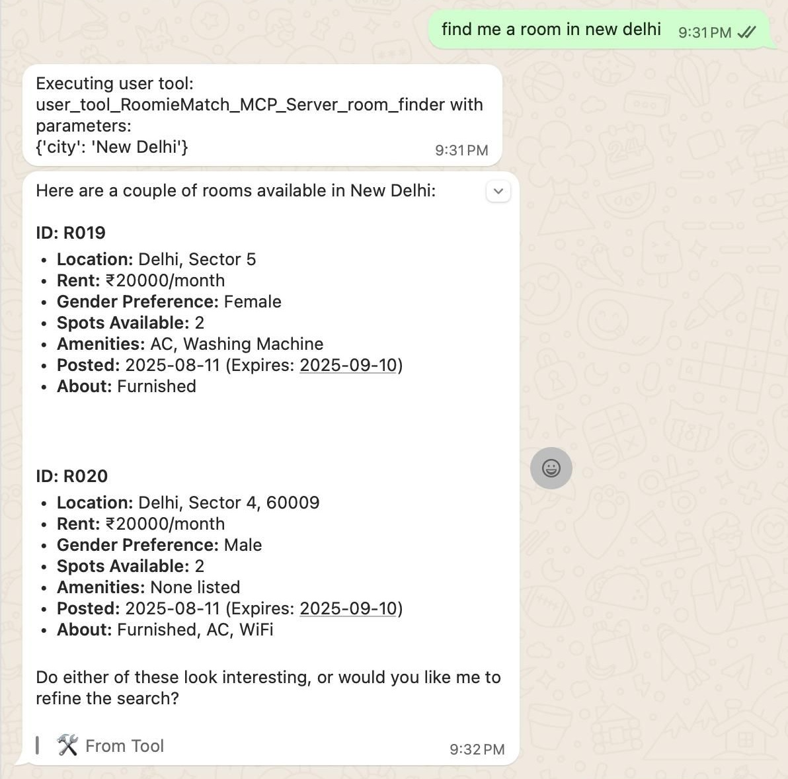
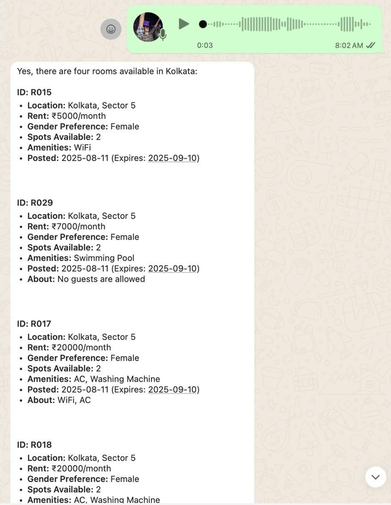
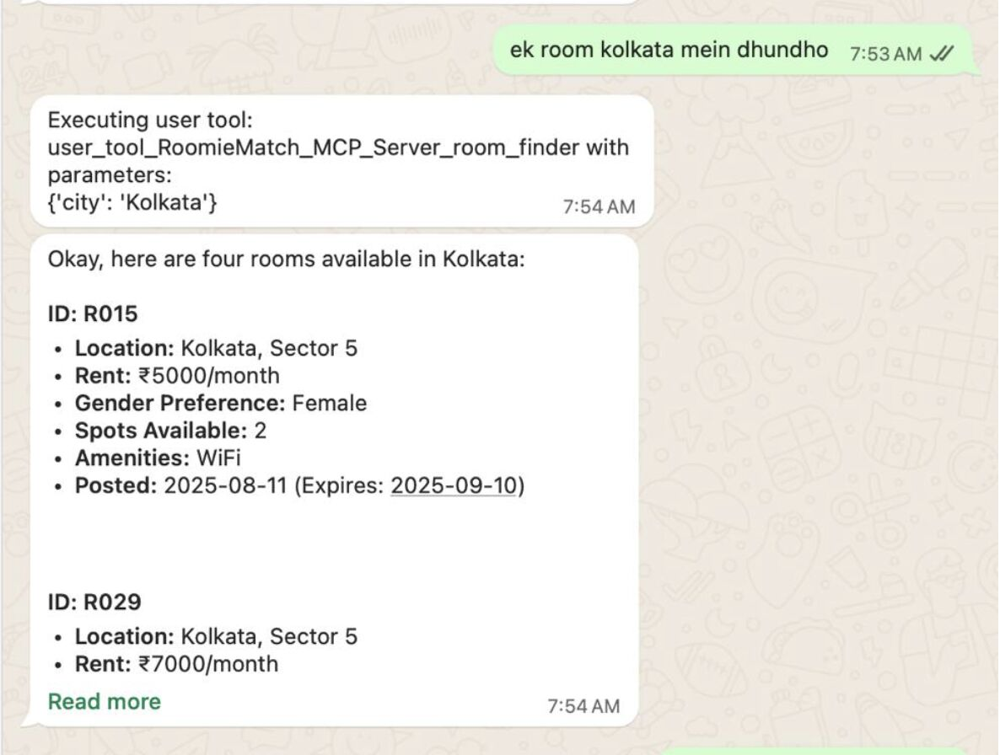
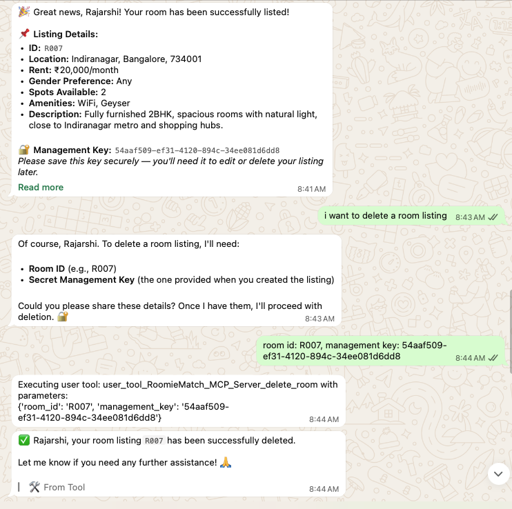

# Whatsapp Chatbot for Finding and Adding Rental Rooms

This is an AI whatsapp chatbot connected with mcp server that enables users to find, add, edit and delete rental rooms from a whatsapp chat window in natural language.

# Tools in Action

1. Finding Rooms
2. Finding Rooms via Voice
3. Finding Rooms in Hinglish
4. Deleting Room

<p>

 
</p>
<br>
<p>


</p>

# Trying the app yourself

You can try out the app yourself locally via ngrok tunelling. Below are the steps:

### Step 1: Clone the project

First, make sure you have Python 3.11 or higher installed. Then:

```bash
# clone the repo
git clone https://github.com/rajarshiroydev/roomie_match.git

# cd into the repo
cd roomie_match
```

### Step 2: Install Dependencies

```bash
# Create virtual environment
uv venv

# Install all required packages
uv sync

# Activate the environment
source .venv/bin/activate
```

### Step 3: Set Up Environment Variables

Create a `.env` file in the project root:

```bash
# Copy the example file
cp .env.example .env
```

Then edit `.env` and add your details:

```env
AUTH_TOKEN=your_secret_token_here
MY_NUMBER=919876543210
```

**Important Notes:**

- `AUTH_TOKEN`: This can be any string. Just make sure to keep it safe and hidden.
- `MY_NUMBER`: Your WhatsApp number in format `{country_code}{number}` (e.g., `919876543210` for +91-9876543210)

### Step 4: Run the Server

```bash
python mcp/agent.py
```

You'll see: `Starting MCP server on http://0.0.0.0:8086`

### Step 5: Install ngrok

1. **Install ngrok:**
   Download from https://ngrok.com/download

2. **Get your authtoken:**

   - Go to https://dashboard.ngrok.com/get-started/your-authtoken
   - Copy your authtoken
   - Run: `ngrok config add-authtoken YOUR_AUTHTOKEN` in command line.

3. **Start the tunnel:**
   ```bash
   ngrok http 8086
   ```

### Step 6: Connect with mcp server on whatsapp.

1. **[Open Puch AI](https://wa.me/+919998881729)** in your whatsapp.
2. Start a new conversation
3. Use the connect command:
   ```
   /mcp connect https://your-domain.ngrok.app/mcp your_secret_token_here
   ```
4. Once connect, start chatting with the AI and use the tools.
5. User /mcp to see all options available related to mcp servers.
